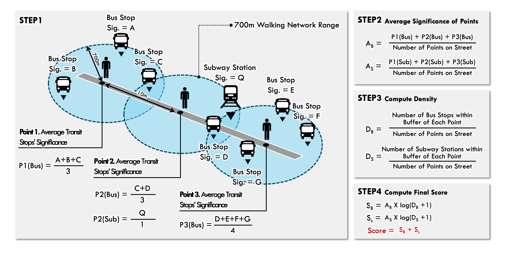

# Transit Accessibility Pipeline (GTFS + OSMnx)

This pipeline calculates **bus and rail accessibility scores** using **GTFS**, **OSMnx**, and **GeoPandas**, and exports the results as an interactive **Folium map** and a CSV file.
The main entry point is:

```bash
python -m scripts.run_pipeline
```

---

## 1️⃣ Installation (Virtual Environment + Dependencies)

### Option A: Standard `venv` + pip

```bash
# Clone repository
git clone <YOUR_REPO_URL> TransitAccessibility
cd TransitAccessibility

# Create and activate virtual environment
python -m venv .venv # Choose your own environment name
# macOS/Linux
source .venv/bin/activate
# Windows (PowerShell)
# .venv\Scripts\Activate.ps1

# Update pip and install dependencies
pip install -U pip
pip install -r requirements.txt
```

> ⚠️ If you encounter errors installing `geopandas`, `pyproj`, or `rtree`,
> we recommend using **Option B (Conda)** below.

---

### Option B: Conda (Recommended)

```bash
# Clone repository
git clone <YOUR_REPO_URL> TransitAccessibility
cd TransitAccessibility

# Create a clean Conda environment
conda create -n gtfs python=3.11 -y
conda activate gtfs

# Install geospatial core packages
conda install -c conda-forge geopandas pyproj rtree -y

# Install remaining dependencies via pip
pip install -r requirements.txt
```

---

## 2️⃣ Data Preparation

Before running, prepare the following folder structure inside the project root:

```
data/
├─ gtfs/                  # GTFS .zip files (can contain multiple)
├─ amenities/
│  └─ all_scores.json     # Stop-level amenity score dictionary
├─ output/                # Output folder (auto-created if missing)
└─ LINE_EPSG4326.geojson  # Study area road network (EPSG:4326)
```

### Notes
* **GTFS**: Place one or more `.zip` feeds inside `data/gtfs/`.
  The pipeline automatically merges and cleans them.
* **`LINE_EPSG4326.geojson`**: A GeoJSON of road segments extracted from the `step1_loader` stage.
  Must be in **EPSG:4326** (WGS84).
* **`amenities`**: Contains precomputed amenity scores (`all_scores.json`).
  This will be integrated with a future pipeline step for automated amenity extraction.
  **If no amenity information is available, leave this directory empty.** The pipeline will still compute without the amenity scores.

### What is GTFS?

**GTFS (General Transit Feed Specification)** is a standardized data format that describes public transportation schedules, stops, routes, and related information.
It was originally developed by Google and Portland’s TriMet to enable transit data integration into Google Maps, and is now widely used by transit agencies around the world.

Each GTFS feed provides complete schedule data for one or more transit providers in a city.

#### 📥 How to get GTFS data

* Most cities or transportation agencies publish their GTFS data publicly.
  Try searching on Google for your city name along with “**GTFS**”.
  For example:

  ```
  "Seoul GTFS"
  "New York City GTFS"
  "London GTFS"
  ```

  This usually leads to an official open-data portal or a public transport API.

* You can also browse and download GTFS feeds from the **Mobility Database**:
  🔗 [https://mobilitydatabase.org/](https://mobilitydatabase.org/)


---

## 3️⃣ Running the Pipeline

Run the pipeline directly from the project root:

```bash
python -m scripts.run_pipeline
```

---

### Execution Flow Overview

1. **Load and process GTFS ZIP files**
   → merges `stops.txt`, `trips.txt`, `routes.txt`, and others into unified dataframes.
2. **Load road network GeoJSON** and convert CRS to the appropriate **local UTM**.
3. **Download pedestrian network** from OSMnx and compute **isochrones** (700m radius, 100m for rail).
4. **Compute stop significance** using the E/S/F/Q scoring model.
5. **Interpolate points along streets** and aggregate scores per link (`scoring.py`).
6. **Save results:**
   * `data/output/bus_rail_score.html` — interactive map
   * `data/output/bus_rail_score.csv` — link-level accessibility scores

---

## 4️⃣ Outputs

* **Interactive map:**
  `data/output/bus_rail_score.html`
* **Score table (CSV):**
  `data/output/bus_rail_score.csv`
  Columns typically include:

  * `link_id`, `Score`, `Score_Bus`, `Score_Rail`, `geometry`, etc.


---

## 5️⃣ Criteria — Final Score Computation (Step-by-Step)

## 1) Selecting Stops in Study Area

* In `run_pipeline.py`, the road centerlines are converted to midpoints and buffered by **750 m** to define the **study boundary**.
* Only **bus and rail stops** that intersect this buffer are selected for analysis.

---

## 2) Isochrone (Walkable Catchment) Generation

* `network.py`

  * Downloads a pedestrian network via **OSMnx**.
  * For each stop, generates convex hulls of reachable nodes within:

    * **700 m** — for all transit modes (`isos_700_*`)
    * **100 m** — for rail modes (`isos_100_rail`)

---

## 3) Stop Significance Calculation

* `analysis.py` computes **four factors (E, S, F, Q)** per stop, then combines them as:

```
significance = E × S × F + Q
```

### 3.1 Factor E — Route Diversity

Represents the number of distinct routes serving a stop:

```
factor_e = 0.5 + 0.5 * min(E, 3)
```

### 3.2 Factor S — Connectivity

* **Bus stops:** Measures how many nearby rail routes overlap within 3 km.

```
factor_s_bus = 1 + 0.5 * min(k, 2)
```

where *k* = number of matching routes within nearby rail stops.

* **Rail stops:** Counts bus stops within the rail stop’s 100 m isochrone.

```
factor_s_rail = 1 + 0.5 * min(S_r, 2)
```

### 3.3 Factor F — Service Frequency

* Days: Monday–Friday
* Peak hours: 07–09 a.m., 16–19 p.m. (6 h total)
* Calculates arrivals per 6 h, averaged across days and routes → `stop_rate_h`

```
< 2 → 1.00  
< 3 → 1.25  
< 4 → 1.50  
≤ 6 → 1.75  
> 6 → 2.00
```

### 3.4 Factor Q — Stop Facilities

* **Bus:** Computed from `amenities/all_scores.json` and `Inventory.csv` using presence of
  *shelter, seating, trash can, route info, schedule, sign*:

```
shelter_index = 2.0 if shelter else 1.0
amenities_index = { ≤1: 1.0, 2–3: 1.5, ≥4: 2.0 }
factor_q_bus = (shelter_index × amenities_index) / 2
```

If no amenity data → `factor_q_bus = 0`.

* **Rail:** Assigned constant value:

```
2.5 (if amenity file exists)  
0.5 (if missing)
```

### 3.5 Combined Stop Significance

```
significance_bus  = E × S_bus × F + Q_bus
significance_rail = E × S_rail × F + Q_rail
```

These values are joined to the 700 m isochrone polygons.

---

## 4) Interpolating Road Points

* `interpolation.py`

  * Each road segment is sampled at **10 m intervals** to produce analysis points along the streets.

---

## 5) Point-Level Aggregation

* `scoring.py`

  * Performs a spatial join between interpolated points and stop isochrones (intersects).
  * For each point:

```
sig_sum_per_point  = Σ (significance of overlapping stops)
stops_count        = number of intersecting stops
sig_mean_per_point = (sig_sum_per_point / stops_count) if stops_count>0 else 0
```

---

## 6) Street-Level Scoring

* Points are grouped by `link_id` to compute:

  * `points_count` = number of points per link
  * `stops_computecount` = total contributing stops
  * `sig_mean_mean` = mean of `sig_mean_per_point`
* Final **link score**:

```
Score = sig_mean_mean × log((stops_computecount / points_count) + 1)
```



---

## 7) Combined and Scaled Score

* `results.py`

  * Merge both modes:

```
Transit_attribute = Score_Bus + Score_Rail
```

* Scale to 0–12.6 (clipped at 22):

```
Transit_score = clip(Transit_attribute, 0, 22) / 22 × 12.6
```

---

## 8) Outputs

* **Interactive map:**
  `data/output/Transit_Attributes_Map.html`
  
* **GeoJSON exports:**

  * `Transit_ATTRIBUTE.geojson` — combined attributes
  * `Transit_SCORE.geojson` — scaled scores

---

### Notes & Edge Cases

* Points with zero intersecting stops default to score = 0.
* All geometry processing occurs in **local UTM CRS**, with outputs converted to **EPSG:4326** for visualization.